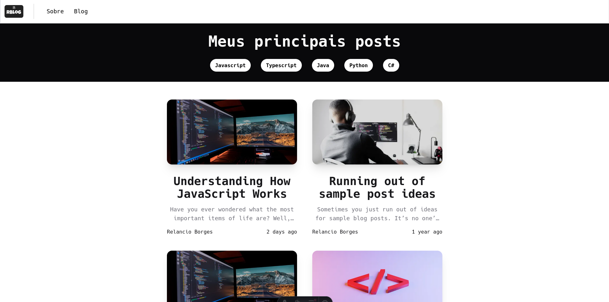

# Ideia

O Astro Blog é um projeto projetado para explorar e demonstrar a funcionalidade do framework Astro, construindo um blog totalmente funcional. O objetivo principal deste projeto é entender as capacidades do Astro e como ele pode ser utilizado no desenvolvimento de aplicativos da web, especialmente blogs.

O Astro oferece uma abordagem única para a construção de sites, permitindo que os desenvolvedores usem ferramentas e frameworks familiares como React e TypeScript, enquanto oferecem benefícios de desempenho por meio de suas capacidades de geração de site estático. Ao criar um blog com Astro, meu objetivo é mostrar a facilidade de uso, flexibilidade e vantagens de desempenho deste framework.

# Desenvolvimento

### Tecnologias e ferramentas utilizadas:

- TypeScript
- React
- Astro
- Tailwind CSS
- Framer Motion

### Processo de Desenvolvimento:

1. **Criação da Seção Inicial**: O processo de desenvolvimento começou com a criação da seção inicial do blog. Isso envolveu o design do layout, implementação da navegação e garantia de responsividade em diferentes dispositivos.

2. **Seção Sobre**: Após a seção inicial, a seção "Sobre" foi desenvolvida para fornecer informações sobre o blog e seus criadores. Esta seção foi projetada para ser visualmente atraente e informativa.

3. **Implementação do Blog**: O núcleo do projeto, a seção do blog, foi então implementado usando Astro. Aproveitando o poder do recurso de Coleções de Conteúdo do Astro, foram criados e organizados artigos de blog de forma eficiente. Este recurso simplifica o processo de gerenciamento de conteúdo do blog e aprimora a experiência geral de desenvolvimento.

### Principais Recursos:

- Utilização do TypeScript para segurança de tipo e experiência de desenvolvimento aprimorada.
- Integração de componentes React para interfaces de usuário dinâmicas e interativas.
- Utilização do recurso de View Transitions, implementado pelo Astro 3.0, para melhorar a transição entre as páginas.
- Aproveitamento das capacidades do Astro para geração de site estático, resultando em melhor desempenho e SEO.
- Estilização com Tailwind CSS para desenvolvimento rápido e design consistente.

# Resultados

O Astro Blog demonstra com sucesso a eficácia do framework Astro na construção de aplicativos da web modernos, especialmente blogs. Através do projeto, conseguimos alcançar os seguintes resultados:

- Um blog totalmente funcional com desempenho otimizado.
- Integração perfeita de componentes React dentro do framework Astro.
- Gerenciamento de quais recursos devem ser estáticos e quais devem ter um comportamento funcional
- Gerenciamento eficiente do conteúdo do blog usando o recurso de Coleções de Conteúdo do Astro.
- Experiência de desenvolvimento aprimorada por meio da integração do TypeScript e Tailwind CSS.

No geral, o Astro Blog serve como um exemplo das capacidades do Astro e seu potencial em simplificar o desenvolvimento web, ao mesmo tempo que oferece resultados excepcionais.

